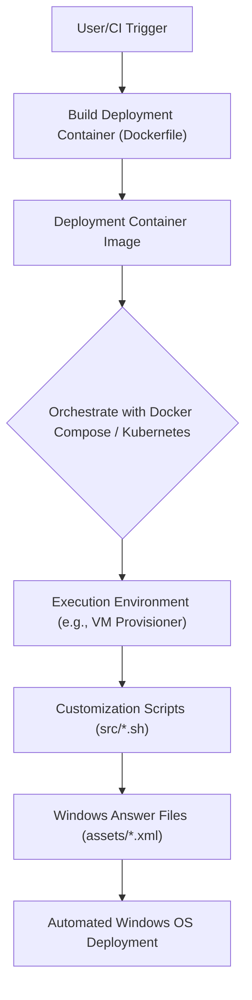

# 🚀 Windows Automation Toolkit

<p align="center"></p>

<p align="center">
    <a href="https://github.com/grewal16/windows/stargazers"></a>
    <a href="https://github.com/grewal16/windows/network/members"></a>
    <a href="https://github.com/grewal16/windows/issues"></a>
    <a href="./license.md"></a>
</p>

## Short Description
The **Windows Automation Toolkit** is a powerful, containerized solution designed to streamline the deployment and configuration of various Microsoft Windows operating systems. From client editions like Windows Vista through Windows 11, to a comprehensive suite of server editions including Windows Server 2008 R2 up to the anticipated Windows Server 2025, this project provides a robust, repeatable, and automated provisioning pipeline. It meticulously leverages Docker, Kubernetes, and an extensive collection of pre-defined XML answer files alongside intelligent shell scripts to simplify complex Windows environment setups.

## 🛡️ Project Health & Status
This project is actively maintained, feature-rich, and engineered for reliability. Its health is continuously monitored and assured through a robust CI/CD pipeline, including automated builds, checks, and tests defined in GitHub Actions. With integrated dependency management via Dependabot and Renovate, all components remain up-to-date and secure, ensuring a stable and trustworthy foundation for your automated deployments.

## ✨ Key Features
*   **Extensive OS Support:** Provides a rich collection of XML configuration files for a wide spectrum of Windows client (Vista, 7, 8.1, 10, 11) and server (2008 R2 - 2025) editions and architectures (x64, x86).
*   **Containerized Provisioning:** Utilizes Docker for packaging the deployment environment and Docker Compose/Kubernetes for orchestrating Windows provisioning workflows.
*   **Automated Unattended Installation:** Features pre-built XML answer files to enable fully unattended Windows installations, drastically reducing manual effort and ensuring consistent deployments.
*   **Flexible Scripted Customization:** Includes a suite of Bash scripts (`define.sh`, `install.sh`, `entry.sh`, `samba.sh`, `power.sh`, `mido.sh`) for advanced post-installation configuration, software deployment, and system hardening.
*   **Seamless Dev Container Integration:** Offers a ready-to-use development environment with pre-configured Visual Studio Code Dev Containers, accelerating contribution and experimentation.

## Who is this for?
This toolkit is an indispensable asset for:
*   **System Administrators & DevOps Engineers:** Automate the provisioning of Windows virtual machines or container hosts with unparalleled ease.
*   **IT Professionals:** Establish standardized, repeatable Windows deployments across an organization, ensuring consistency and compliance.
*   **Developers:** Rapidly set up testing, development, or production Windows environments for application compatibility or integration testing.
*   Anyone seeking a robust, version-controlled, and automated approach to managing Windows configurations.

## Technology Stack & Architecture
The project's core functionality is built upon a versatile technology stack, typically leveraging a Unix-like environment (often containerized) to orchestrate Windows deployments.
*   **Containerization:** Docker (for image definition), Docker Compose (for local orchestration)
*   **Orchestration:** Kubernetes (manifests provided for scalable deployments)
*   **Scripting:** Bash (for core logic, automation, and installation routines)
*   **Development Environment:** Visual Studio Code Dev Containers
*   **Configuration:** XML (the standard format for Windows unattended installation answer files)
*   **CI/CD & Security:** GitHub Actions, Dependabot, Renovate

## 📊 Architecture & Database Schema
This project's architecture focuses on a declarative pipeline for automated Windows provisioning, not data persistence. The design emphasizes leveraging containerized tooling to apply pre-defined configurations to a target Windows environment.



## ⚙️ Configuration & Deployment
The project offers flexible options for configuration and deployment:

*   **Container Image:** The `Dockerfile` defines the base image, encapsulating all necessary tools and scripts for Windows provisioning.
*   **Local Development & Testing:** The `compose.yml` file allows you to quickly spin up a local environment using Docker Compose, ready for testing provisioning workflows.
*   **Kubernetes Orchestration:** `kubernetes.yml` provides a template for deploying the provisioning workflow as a robust, scalable service within a Kubernetes cluster.
*   **Dev Container Integration:** Utilize the `.devcontainer.json` for an instant, pre-configured development environment within Visual Studio Code, ensuring consistency across contributors.

Primary configuration involves selecting the appropriate Windows answer file from the `assets/` directory and executing the relevant `src/*.sh` scripts within your chosen containerized environment.

## ⚡ Quick Start Guide
To quickly set up and start using the Windows Automation Toolkit:

1.  **Clone the Repository:**
    ```bash
    git clone https://github.com/grewal16/windows.git
    cd windows
    ```
2.  **Build the Docker Image:**
    ```bash
    docker build -t windows-toolkit .
    ```
3.  **Run with Docker Compose (example for provisioning):**
    Launch the toolkit environment using Docker Compose:
    ```bash
    docker compose up -d
    # Then, execute provisioning commands within the running container service.
    # Replace 'win11x64' with your desired OS from 'assets/'
    docker compose exec toolkit /bin/bash -c "src/install.sh --os win11x64-enterprise"
    ```
    *(Note: Actual provisioning steps will depend on your target environment, hypervisor, and the specific scripts within `src/`.)*
4.  **Explore Assets:** Dive into the `assets/*.xml` files to understand the vast array of pre-configured Windows versions and editions available for your deployments.

## 📜 License
This project is licensed under the terms of the MIT License. See the [LICENSE.md](license.md) file for full details.