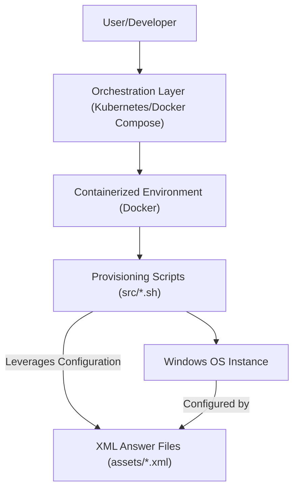

# 🚀 Windows

<p align="center"></p>

<p align="center">
    <a href="https://github.com/grewal16/windows/stargazers"></a>
    <a href="https://github.com/grewal16/windows/network/members"></a>
    <a href="https://github.com/grewal16/windows/issues"></a>
    <a href="./license.md"></a>
</p>

## Short Description
This project delivers a powerful, automated solution for provisioning and managing a wide range of Microsoft Windows operating system environments, from client versions like Windows 7, 8.1, 10, and 11, to server editions including Windows Server 2008R2 through 2025. Leveraging pre-configured XML answer files, containerization, and orchestration, it streamlines the setup of pristine Windows instances for development, testing, and operational needs.

## 🛡️ Project Health & Status
This project is in active development, backed by robust CI/CD pipelines configured via GitHub Actions. Continuous integration ensures consistent quality, code integrity, and immediate feedback on changes, indicating a reliable and well-maintained codebase.

## ✨ Key Features
*   **Automated Windows Provisioning:** Rapidly deploy various Windows operating systems using pre-configured unattended installation XML answer files.
*   **Extensive OS Support:** Comprehensive coverage for Windows client versions (7, 8.1, 10, 11) and server editions (2008R2, 2012R2, 2016, 2019, 2022, 2025).
*   **Containerization Ready:** Full Docker support for creating isolated, reproducible Windows environments.
*   **Orchestration Friendly:** Designed for seamless integration with Docker Compose for local multi-container setups and Kubernetes for scalable deployments.
*   **Scripted Management:** Powerful shell scripts (`define.sh`, `install.sh`, `entry.sh`, `power.sh`, `samba.sh`, `mido.sh`) for automating post-installation configuration and ongoing management tasks.
*   **Developer Experience:** Includes `.devcontainer.json` for a consistent and quick development environment setup.

## Who is this for?
This project is ideal for DevOps engineers, system administrators, developers, quality assurance teams, and security researchers who require efficient, reproducible, and easily disposable Windows environments for testing, development, and operational tasks.

## Technology Stack & Architecture
*   **Operating Systems:** Windows (Various Client and Server SKUs), Linux (Host/Container OS)
*   **Languages:** Shell Script (Bash)
*   **Containerization:** Docker
*   **Orchestration:** Docker Compose, Kubernetes
*   **Configuration:** XML Answer Files
*   **Development Environment:** Dev Containers

## 📊 Architecture & Database Schema
The project's architecture focuses on orchestrating and provisioning Windows environments within a containerized or virtualized setup.



## ⚙️ Configuration & Deployment
This project is designed for flexible deployment.
*   **Local Development/Testing:** Utilize `Dockerfile` and `compose.yml` with Docker Desktop or a compatible environment to quickly spin up instances.
*   **Production/Scalable Environments:** `kubernetes.yml` provides a blueprint for deploying and managing Windows environments within a Kubernetes cluster.
*   **Development Containers:** The `.devcontainer.json` file enables a fully configured development environment using VS Code Remote – Containers, ensuring all dependencies are met for contributing to the project.

## ⚡ Quick Start Guide
To get started with a containerized Windows environment:

1.  **Prerequisites:** Ensure Docker and Docker Compose are installed on your system.
2.  **Clone the Repository:**
    ```bash
    git clone https://github.com/grewal16/windows.git
    cd windows
    ```
3.  **Build the Docker Image:**
    ```bash
    docker build -t windows-env .
    ```
4.  **Run with Docker Compose (Example):**
    ```bash
    docker compose up -d
    ```
    This will start a service defined in `compose.yml`, which provisions a Windows environment. Refer to the `src/` scripts and `assets/` XML files to customize your specific Windows deployment.

## 📜 License
This project is licensed under the terms of the [MIT License](./license.md).