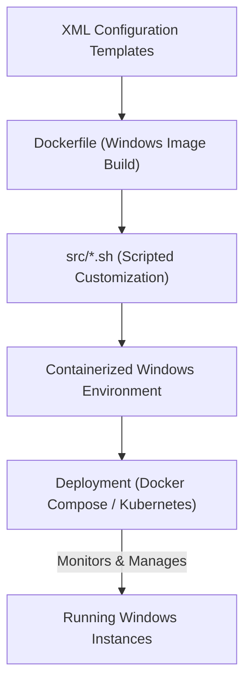

# 🚀 Windows Automation Framework

<p align="center"></p>

## Short Description

Unleash the full potential of automated Windows environment provisioning! This robust framework provides a comprehensive toolkit for building, configuring, and deploying customized Windows images across various versions and editions, all orchestrated with modern containerization and infrastructure-as-code principles. From legacy Windows Server to the latest Windows 11, achieve consistent, repeatable, and scalable deployments.

## 🛡️ Project Health & Status

This project is in **active and robust development**, backed by a comprehensive suite of GitHub Actions workflows ensuring continuous integration, build integrity, and test validation. With automated dependency updates (Dependabot, Renovate) and structured issue templates, the codebase is meticulously maintained and poised for reliability. Expect regular updates and a stable, high-quality experience.

## ✨ Key Features

*   **Multi-Version Windows Support:** Seamlessly provision Windows 7, 8.1, 10, 11, and Server editions (2008R2 to 2025) with pre-configured XML templates.
*   **Containerized Environments:** Leverage `Dockerfile` to create isolated, portable Windows environments for development, testing, or specialized applications.
*   **Orchestration Ready:** Deploy and manage your Windows containers at scale using `docker-compose.yml` for local development or `kubernetes.yml` for production-grade clusters.
*   **Powerful Shell Automation:** A collection of `src/*.sh` scripts provides granular control over installation, configuration (e.g., Samba for file sharing, power settings), and entrypoint execution.
*   **Development Container Integration:** Jumpstart your development with `.devcontainer.json` for a pre-configured and consistent coding environment.
*   **CI/CD Pipeline:** Integrated GitHub Actions for automated builds, checks, and tests ensure code quality and deployment readiness.

## Who is this for?

*   **DevOps Engineers & System Administrators:** Automate the provisioning and management of Windows-based infrastructure and applications.
*   **Developers:** Quickly spin up consistent Windows development or testing environments.
*   **Testers:** Create reproducible testbeds for Windows applications across different OS versions.
*   **Educators & Researchers:** Establish clean, standardized Windows instances for labs and experiments.

## Technology Stack & Architecture

This framework is built upon a foundation of powerful automation and containerization technologies:

*   **Core Automation:** Bash Shell Scripting (`.sh`) for intricate system setup and configuration.
*   **Configuration Management:** XML-driven templates for declarative Windows image customization.
*   **Containerization:** Docker (`Dockerfile`) for packaging isolated Windows environments.
*   **Orchestration:** Docker Compose (`compose.yml`) for local multi-container management, and Kubernetes (`kubernetes.yml`) for scalable cluster deployments.
*   **Development Experience:** Visual Studio Code Dev Containers (`.devcontainer.json`) for a consistent and shareable development environment.
*   **CI/CD:** GitHub Actions (`.github/workflows`) for robust automation of build, test, and deploy processes.

## 📊 Architecture & Database Schema

This project is focused on provisioning and orchestration rather than data persistence, so no database schema is present. The high-level architecture describes the flow of automating Windows environment creation:



## ⚙️ Configuration & Deployment

Deployment is streamlined through containerization and orchestration tooling:

1.  **Container Build:** A `Dockerfile` defines the base Windows image and initial setup.
2.  **Configuration:** Customization is driven by `assets/*.xml` files, injected and processed by the shell scripts during image build or container startup.
3.  **Local Deployment:** Utilize `compose.yml` to effortlessly spin up a locally containerized Windows environment with Docker Compose.
4.  **Cluster Deployment:** For scalable, production-ready deployments, `kubernetes.yml` provides the necessary manifests to deploy your Windows containers onto a Kubernetes cluster.
5.  **Dev Environment:** For development, use the provided `.devcontainer.json` to launch a pre-configured VS Code environment directly with Docker.

## ⚡ Quick Start Guide

To get your automated Windows environment up and running:

1.  **Clone the Repository:**
    ```bash
    git clone https://github.com/grewal16/windows.git
    cd windows
    ```
2.  **Build Your Windows Image:**
    ```bash
    docker build -t my-windows-env .
    ```
3.  **Run with Docker Compose (Local Development):**
    ```bash
    docker-compose up -d
    ```
    This will start a Windows container based on your configuration.
4.  **Deploy to Kubernetes (Production):**
    ```bash
    kubectl apply -f kubernetes.yml
    ```
    Ensure your Kubernetes cluster supports Windows nodes.

## 📜 License

This project is licensed under the terms found in the `license.md` file.