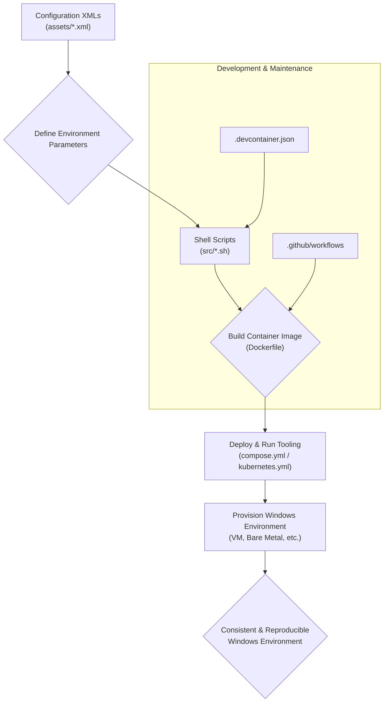

# 🚀 Windows Environment Automation Kit

<p align="center"></p>

## Short Description
The **Windows Environment Automation Kit** is a powerful and flexible project designed to streamline the definition, provisioning, and management of diverse Windows operating system environments. From legacy Windows Vista to modern Windows 11 and server editions, this kit empowers developers, DevOps engineers, and system administrators to create consistent, reproducible, and easily deployable Windows setups using a modern, container-driven approach. Leverage pre-configured XML answer files, robust shell scripting, and integrate seamlessly into your CI/CD pipelines.

## ✨ Key Features
*   **Comprehensive Windows Support:** Automated provisioning for a vast range of Windows client (Vista, 7, 8.1, 10, 11) and server (2008R2 to 2025) operating systems.
*   **Automated Configuration:** Utilizes detailed XML answer files (`assets/*.xml`) for unattended installation and configuration, ensuring consistency across deployments.
*   **Containerized Tooling:** Packaged with Docker (`Dockerfile`, `compose.yml`) to provide a portable and consistent environment for executing provisioning scripts.
*   **Orchestration Ready:** Includes Kubernetes manifests (`kubernetes.yml`) for scalable deployment and management of Windows-related services or virtual machine orchestrators.
*   **Developer-Friendly:** Integrated with VS Code Dev Containers (`.devcontainer.json`) for an immediate, ready-to-code development experience.
*   **Robust CI/CD:** Features GitHub Actions workflows (`.github/workflows`) for automated building, checking, and testing of the project components.
*   **Maintainable Dependencies:** Automated dependency management with Dependabot and Renovate for enhanced security and up-to-date tooling.
*   **Structured Development:** Clear issue templates (`.github/ISSUE_TEMPLATE`) to foster effective collaboration and project management.

## Who is this for?
*   **DevOps Engineers:** Automate the creation and destruction of Windows VMs or environments for testing, staging, and production.
*   **Software Developers:** Quickly spin up consistent Windows development or testing environments without manual setup overhead.
*   **QA Engineers:** Ensure reproducible test environments across different Windows versions and configurations.
*   **System Administrators:** Standardize Windows deployments and configurations across an organization.
*   **Security Researchers:** Rapidly deploy specific Windows versions for vulnerability analysis or exploit development.

## Technology Stack & Architecture
*   **Operating Systems:** Windows (client & server) from Vista to Windows 11/Server 2025.
*   **Automation/Scripting:** Bash Shell Scripts (`src/*.sh`), XML Answer Files (`assets/*.xml`).
*   **Containerization:** Docker, Docker Compose.
*   **Orchestration:** Kubernetes.
*   **Development Environment:** VS Code Dev Containers.
*   **CI/CD:** GitHub Actions.
*   **Dependency Management:** Dependabot, Renovate.

## 📊 Architecture & Database Schema
This project's core value lies in its process for automating Windows environment setup. The following flowchart illustrates the typical workflow:



## ⚡ Quick Start Guide

To get started with the Windows Environment Automation Kit, you'll need Docker installed on your system.

1.  **Clone the repository:**
    ```bash
    git clone https://github.com/grewal16/windows.git
    cd windows
    ```

2.  **Build the Docker image:**
    This command will build the image containing all necessary scripts and tools.
    ```bash
    docker build -t windows-automation-kit .
    ```

3.  **Run with Docker Compose (example):**
    Use `docker compose` to run a service that utilizes these automation scripts. You would typically modify `compose.yml` to specify which `src/*.sh` script to execute based on your provisioning needs.

    ```bash
    docker compose up
    ```

    *Refer to the individual shell scripts in `src/` and XML files in `assets/` for specific usage and customization options.*

## 📜 License
This project is licensed under the terms found in the [LICENSE.md](LICENSE.md) file.
