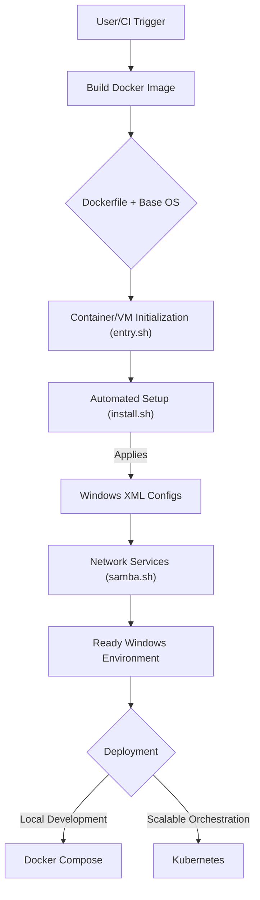

# 🚀 Windows Environment Automation Hub

Unlock the full potential of your development, testing, and deployment workflows with this comprehensive solution for automating the setup of diverse Windows operating systems. From legacy servers to the latest client versions, this repository provides a robust, container-centric approach to provision consistent and reproducible Windows environments with unprecedented ease.

## Short Description

This project empowers developers and DevOps engineers to effortlessly define, build, and deploy various Windows operating systems, both client and server editions, within highly automated and portable containerized or virtualized contexts. Leveraging Docker, Kubernetes, and an extensive collection of unattended installation configurations, it streamlines the creation of bespoke Windows environments for any purpose.

## ✨ Key Features

*   **Broad OS Support:** Instantly provision a wide array of Windows versions, including Windows Vista, 7, 8.1, 10, 11, and Server editions from 2008R2 up to 2025.
*   **Automated Provisioning:** Utilize pre-configured XML answer files and intelligent shell scripts for fully unattended, hands-off Windows installations and setups.
*   **Containerization Ready:** Comes equipped with `Dockerfile` and `compose.yml` for building and orchestrating Windows environments as Docker containers or images, ensuring portability and isolation.
*   **Kubernetes Integration:** Seamlessly scale and manage your Windows instances in production with battle-tested Kubernetes deployment configurations.
*   **Developer-Friendly:** Integrated with VS Code Dev Containers for a consistent and quick setup of your development workspace.
*   **Robust CI/CD Pipelines:** Leverage GitHub Actions for automated build, test, and deployment workflows, ensuring code quality and continuous delivery.
*   **Modular Scripting:** Highly organized and modular shell scripts (`define.sh`, `install.sh`, `samba.sh`, etc.) allow for easy customization and extension of the provisioning process.

## Who is this for?

*   **Developers:** Need a quick, consistent, and disposable Windows environment for testing applications, cross-browser compatibility, or specific OS features.
*   **DevOps Engineers:** Automate the creation and management of Windows-based testing or staging environments as part of your CI/CD pipelines.
*   **System Administrators:** Rapidly provision and configure Windows servers or workstations for virtualized infrastructure or cloud deployments.
*   **QA Teams:** Establish standardized testing matrices across different Windows versions without manual setup overhead.
*   **Security Researchers:** Quickly spin up isolated Windows instances for analysis or experimentation.

## Technology Stack & Architecture

*   **Containerization & Orchestration:** Docker, Docker Compose, Kubernetes
*   **Scripting & Automation:** Bash Shell Scripts (`src/*.sh`), XML Unattended Installation Files (`assets/*.xml`)
*   **Development Environment:** VS Code Dev Containers (`.devcontainer.json`)
*   **CI/CD:** GitHub Actions (`.github/workflows/*.yml`), Dependabot, Renovate
*   **Supported OS:** Windows Client (Vista, 7, 8.1, 10, 11), Windows Server (2008R2, 2012R2, 2016, 2019, 2022, 2025)

## 📊 Architecture & Database Schema

The core architecture revolves around building highly customized Windows environments using an automated, script-driven approach, typically within a containerized context.



## ⚡ Quick Start Guide

To get a basic Windows environment up and running quickly:

1.  **Clone the repository:**
    ```bash
    git clone https://github.com/grewal16/windows.git
    cd windows
    ```
2.  **Build the Docker image (e.g., for Windows 10 x64):**
    You would typically adapt the `Dockerfile` or use a pre-built one. This project implies a method to inject the XML assets. For a direct build, you'd integrate the desired `assets/*.xml` into the `Dockerfile`'s build process or volume mount them at runtime. A common approach for this pattern is:
    ```bash
    # (Assuming your Dockerfile is set up to consume these assets)
    docker build -t my-windows-env .
    ```
3.  **Run with Docker Compose:**
    The `compose.yml` provides a streamlined way to launch your environment.
    ```bash
    docker compose up -d
    ```
    This command will build (if necessary) and start the Windows service as defined in `compose.yml`.

## 📜 License

This project is licensed under the MIT License. See the `license.md` file for full details.
