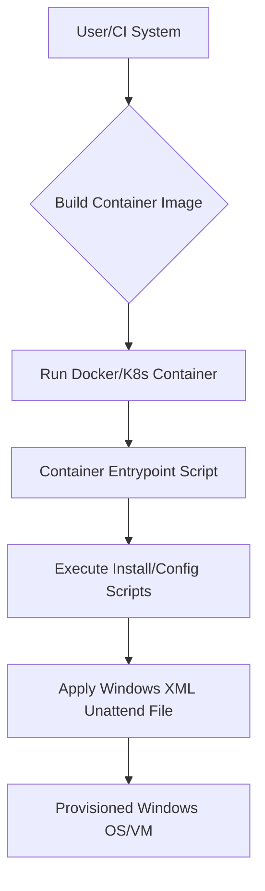

# 🚀 Windows Automation Toolkit

<p align="center"></p>

## Short Description
Unlock effortless, automated deployment and management of Windows operating systems within modern containerized environments. This project provides a comprehensive, highly configurable toolkit for provisioning a vast array of Windows versions, from desktops like Vista and Windows 11 to various Windows Server editions, leveraging pre-configured XML files and powerful shell scripts, all integrated for Docker and Kubernetes.

## ✨ Key Features
*   **Extensive Windows OS Support:** Seamlessly provision a wide range of Windows versions including Vista, 7, 8.1, 10, 11, and server editions from 2008R2 up to 2025.
*   **Automated Unattended Provisioning:** Utilize an extensive library of `.xml` configuration files for fully automated, hands-free Windows installations and setups.
*   **Container-Native Design:** Built with `Dockerfile`, `compose.yml`, and `kubernetes.yml` for easy deployment, scaling, and management in Docker and Kubernetes ecosystems.
*   **Powerful Scripting Engine:** Leverages robust shell scripts (`define.sh`, `install.sh`, `entry.sh`, `samba.sh`, `power.sh`) to orchestrate complex installation, configuration, and management tasks.
*   **Integrated CI/CD Pipelines:** Ready for GitHub Actions with predefined workflows for `build`, `check`, and `test`, ensuring continuous quality and integration.
*   **Developer-Friendly Environments:** Includes `.devcontainer.json` for standardized development setups, enabling quick onboarding and consistent development experiences.
*   **Proactive Dependency Management:** Automated dependency updates via Dependabot and Renovate ensure your tooling and configurations stay secure and up-to-date.

## Who is this for?
This toolkit is engineered for:
*   **DevOps Engineers** seeking to automate Windows environment provisioning.
*   **System Administrators** needing to quickly deploy and manage multiple Windows instances.
*   **IT Professionals** looking for consistent, repeatable Windows setups.
*   **Developers** requiring isolated Windows testing or build environments.
*   **QA Engineers** creating standardized Windows test beds.

## Technology Stack & Architecture
*   **Core Logic:** Shell Scripting (`Bash`)
*   **Configuration:** XML (Unattended Windows setup files)
*   **Containerization:** Docker (`Dockerfile`, `Docker Compose`)
*   **Orchestration:** Kubernetes
*   **CI/CD:** GitHub Actions
*   **Development Environment:** Visual Studio Code DevContainers
*   **Dependency Management:** Dependabot, Renovate

## 📊 Architecture & Database Schema
This project facilitates a streamlined process for provisioning Windows environments.



## ⚡ Quick Start Guide
To get started with this powerful automation toolkit, follow these simple steps using Docker:

1.  **Clone the Repository:**
    ```bash
    git clone https://github.com/grewal16/windows.git
    cd windows
    ```

2.  **Build the Docker Image:**
    This command will build a Docker image based on the `Dockerfile`.
    ```bash
    docker build -t windows-automation .
    ```

3.  **Run with Docker Compose (Recommended for Local Development/Testing):**
    If you have Docker Compose installed, you can quickly spin up an environment.
    ```bash
    docker compose up -d
    ```
    This will start a container based on the `compose.yml` configuration, which likely uses the `windows-automation` image you just built and executes the primary entrypoint script. Refer to the `compose.yml` and `src/entry.sh` for specific runtime parameters and asset usage.

## 📜 License
This project is licensed under the terms found in the [license.md](./license.md) file.
